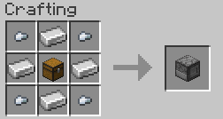

# Fridges
Simple fabric mod that adds fridge into minecraft

## Installation
1. Install [Fabric Loader](https://fabricmc.net/use/)
2. Install [Fabric API](https://modrinth.com/mod/fabric-api)
3. Install Fridges
4. Enjoy!

## Features
- Fridges can store up to 27 items
- Can store only food
- Can transform rotten flesh into leather (every minute)

## Usage
1. Craft a fridge
2. Place it down
3. Place items in it
4. Done!

### Recipe

